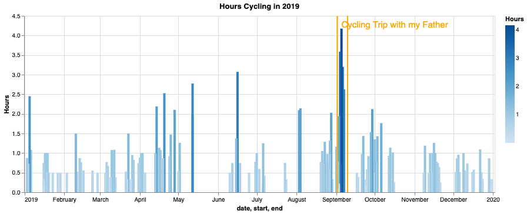

# Analyzing My 2019 Cycling Data

#### Project Status: Completed

## Project Intro/Objective
The purpose of this project was to conduct an exploratory data analysis on my 2019 cycling data.

### Methods Used
* Statistics
* Data Visualization
* Time Series

### Technologies
* Python
* Altair
* [The Strava API](https://developers.strava.com/)
* [Stravalib](https://pythonhosted.org/stravalib/index.html)
* Pandas
* Jupyter Notebooks

### Credits
* [David Yang's Download Running Data From Strava to Analyze Yourself](https://medium.com/@xdyang70/running-data-analysis-61ac6b08945c)
* [Mark Koester's qs_ledger](https://github.com/markwk/qs_ledger)

## Project Description
I have been using [Strava](www.strava.com) to house all of my cycling data since 2013. Using the [Strava API](https://developers.strava.com/), Python, Altair, and Jupyter notebooks, I extracted and analyzed my cycling data from 2019. In doing so, I answered the following questions: 
 - What percentage of days in 2019 did I ride?
 - How many miles did I ride throughout the year?
 - How many hours did I ride throughout the year?
 - What were the number of rides by 30 minute durations?
 - What were the number of rides by distances?
 - What was my variation in wattage like?
 - What was my variation in heart rate like?
 - On average, how many hours did I ride per day of the week?
 - Can I find any correlations between my different cycling data points?
 - etc.
 

## Getting Started

1. Clone this repo (for help see this [tutorial](https://help.github.com/articles/cloning-a-repository/)).
2. Modify credentials.py with your own [client ID and client Secret](https://www.strava.com/settings/api).  
    
3. Run 2020-01-29-analysis.ipynb
4. Click on the link in the second cell, replace the code variable with the string you see in the URL, then execute the rest of the notebook.

5. Consult [David Yang's Download Running Data From Strava to Analyze Yourself](https://medium.com/@xdyang70/running-data-analysis-61ac6b08945c) if you have any issues or contact me. 

## Deliverables
* [Notebook](https://github.com/chasekregor/StravaCyclingAnalysis2019/blob/master/notebooks/2020-01-29-analysis.ipynb)
* [README.md](https://github.com/chasekregor/StravaCyclingAnalysis2019/blob/master/README.md)

## Contact
* [chasekregor.com](www.chasekregor.com)